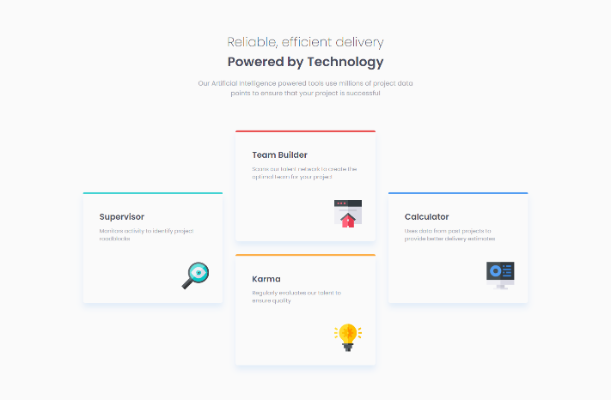
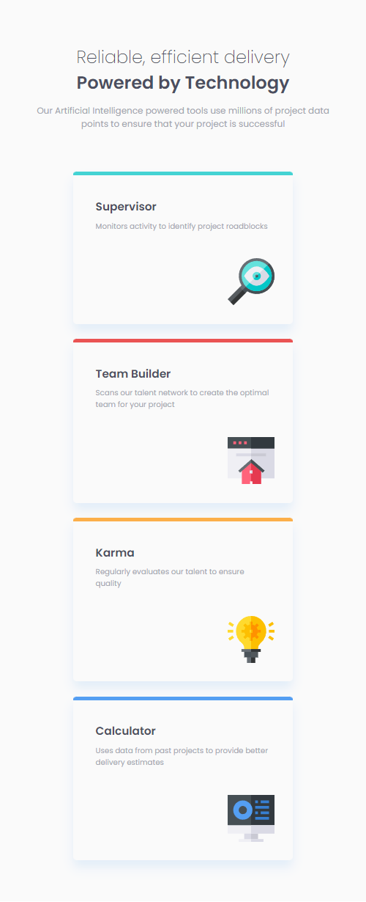

# Frontend Mentor - Four card feature section solution

This is a solution to the [Four card feature section challenge on Frontend Mentor](https://www.frontendmentor.io/challenges/four-card-feature-section-weK1eFYK). Frontend Mentor challenges help you improve your coding skills by building realistic projects. 

## Table of contents

- [Overview](#overview)
  - [Screenshot](#screenshot)
  - [Links](#links)
- [My process](#my-process)
  - [Built with](#built-with)
  - [What I learned](#what-i-learned)
- [Author](#author)
- [Acknowledgments](#acknowledgments)

*## Overview

### The challenge

Users should be able to:

- View the optimal layout for the component depending on their device's screen size
- See hover states for all interactive elements on the page

### Screenshot

 

### Links

- Solution URL: [bikeinman.github.io](https://bikeinman.github.io/frontend-mentor-4-cards/)

## My process

### Built with

- HTML5
- CSS

### What I learned

- How to use css variables
- How to design subtle card shadows
- Reconfirming some UI design fundamentals

## Author

- Frontend Mentor - [@BikeInMan](https://www.frontendmentor.io/profile/BikeInMan)

## Acknowledgments
All thanks to frontend mentor for providing such a great challenge.